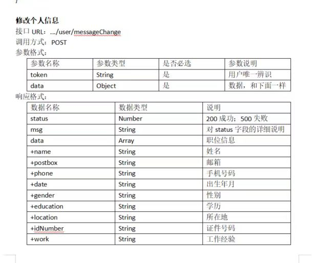

# FrontAssessment

> 本项目为**MetaCode工作室**前端二轮考核所需接口

## 开发环境

| 开发工具 | IntelliJ IDEA 2023.2.1                                |
| -------- | ----------------------------------------------------- |
| 编程语言 | Kotlin                                                |
| 运行环境 | Java(TM) SE Runtime Environment (build 1.8.0_381-b09) |
| 构建工具 | maven                                                 |
| 编译环境 | Kotlin 1.9.23                                         |

> 本项目尝试使用Kotlin编写

接口文档地址（一个月内有效）

## 需求分析

本项目为**MetaCode工作室**前端二轮考核接口文档，需要实现库洛官网的页面效果

官网地址如下👇

https://app.mokahr.com/social-recruitment/kuro/46886#/home

截至项目完工时（2024.03.31）仍有效

采用python脚本形式获取数据

脚本存放于src/main/python文件夹下，使用Anconda作为包管理器

```cmd
# create new anaconda env
conda create -n FroneAssessment python=3.8.18 -y
conda activate FroneAssessment

# install python dependencies
pip install -r requirements.txt

# execute this cmd
python getInfo.py
```

> 使用的是谷歌浏览器，版本为100，同时需安装chromedriver.exe，版本需至少高于100
>
> getInfo.py的路径改为谷歌浏览器何驱动的绝对路径

## 需求文档



**热招职位**

接口URL：.../position

调用方式：GET

响应格式：

|                    |          |                        |
| ------------------ | -------- | ---------------------- |
| 数据名称           | 数据类型 | 说明                   |
| status             | Number   | 200成功；500失败       |
| msg                | String   | 对status字段的详细说明 |
| data               | Array    | 职位类型列表           |
| +id                | Number   | 职位类型id             |
| +positionClassName | String   | 职位类型名称           |
| +positionNumber    | Number   | 职位数量               |

响应举例：

{

“status”:200,

“msg”:“获取职位类型成功”,

“data”:\[

{“id”: 1, “positionClassName”: “美术类”, “positionNumber”: 49},

{“id”: 2, “positionClassName”: “营销类”, “positionNumber”: 41},

{“id”: 3, “positionClassName”: “技术类”, “positionNumber”: 20},

{“id”: 4, “positionClassName”: “策划类”, “positionNumber”: 17},

{“id”: 5, “positionClassName”: “职能类”, “positionNumber”: 14},

{“id”: 6, “positionClassName”: “运营类”, “positionNumber”: 10},

{“id”: 7, “positionClassName”: “项管类”, “positionNumber”: 8},

{“id”: 8, “positionClassName”: “音频类”, “positionNumber”: 5}

\]

}

**职位搜索**

接口URL：.../position/search

调用方式：POST

参数格式：

|          |          |          |            |
| -------- | -------- | -------- | ---------- |
| 参数名称 | 参数类型 | 是否必选 | 参数说明   |
| keyword  | String   | 否       | 职位关键词 |
| type     | String   | 否       | 职位类型   |
| place    | String   | 否       | 工作地点   |

响应格式：

|               |          |                        |
| ------------- | -------- | ---------------------- |
| 数据名称      | 数据类型 | 说明                   |
| status        | Number   | 200成功；500失败       |
| msg           | String   | 对status字段的详细说明 |
| data          | Array    | 职位列表               |
| +id           | Number   | 职位id                 |
| +positionName | String   | 职位名称               |
| +positionTime | String   | 发布时间               |

响应举例：

{

“status”:200,

“msg”:“获取职位列表成功”,

“data”:\[

{“id”: 1, “positionName”: “xx项目负责人”, “positionTime”: “2024-12-12”},

{“id”: 2, “positionName”: “xx运营”, “positionTime”: “2023-12-12”},

{“id”: 3, “positionName”: “xx项目经理”, “positionTime”: “2024-2-23”},

{“id”: 4, “positionName”: “xx实习生”, “positionTime”: “2024-1-2”},

......

\]

}

**职位页面详细信息**

接口URL：.../position/message

调用方式：POST

参数格式：

|          |          |          |          |
| -------- | -------- | -------- | -------- |
| 参数名称 | 参数类型 | 是否必选 | 参数说明 |
| id       | String   | 是       | 职位id   |

响应格式：

|                   |          |                        |
| ----------------- | -------- | ---------------------- |
| 数据名称          | 数据类型 | 说明                   |
| status            | Number   | 200成功；500失败       |
| msg               | String   | 对status字段的详细说明 |
| data              | Array    | 职位信息               |
| +positionName     | String   | 职位名称               |
| +positionDescribe | String   | 职位描述               |
| +place            | String   | 工作地点               |
| +time             | String   | 发布时间               |

响应举例：

{

“status”:200,

“msg”:“获取职位信息成功”,

“data”:{

“positionName”: “xx运营负责人”,

“positionDescribe”: “岗位职责：....... 岗位要求：......”,

“place”: “广州市”,

“time”: “2024-12-2”

}

}

**注册**

接口URL：.../user/register

调用方式：POST

参数格式：

|            |          |          |            |
| ---------- | -------- | -------- | ---------- |
| 参数名称   | 参数类型 | 是否必选 | 参数说明   |
| number     | String   | 是       | 账号       |
| password   | String   | 是       | 密码       |
| repassword | String   | 是       | 第二遍密码 |

响应格式：

|          |          |                        |
| -------- | -------- | ---------------------- |
| 数据名称 | 数据类型 | 说明                   |
| status   | Number   | 200成功；500失败       |
| msg      | String   | 对status字段的详细说明 |
| data     | Array    | 职位信息               |
| +token   | String   | 用户唯一辨识           |

**登录**

接口URL：.../user/login

调用方式：POST

参数格式：

|          |          |          |          |
| -------- | -------- | -------- | -------- |
| 参数名称 | 参数类型 | 是否必选 | 参数说明 |
| number   | String   | 是       | 账号     |
| password | String   | 是       | 密码     |

响应格式：

|          |          |                        |
| -------- | -------- | ---------------------- |
| 数据名称 | 数据类型 | 说明                   |
| status   | Number   | 200成功；500失败       |
| msg      | String   | 对status字段的详细说明 |
| data     | Array    | 职位信息               |
| +token   | String   | 用户唯一辨识           |

**获取个人信息**

接口URL：.../user/message

调用方式：POST

参数格式：

|          |          |          |              |
| -------- | -------- | -------- | ------------ |
| 参数名称 | 参数类型 | 是否必选 | 参数说明     |
| token    | String   | 是       | 用户唯一辨识 |

响应格式：

|            |          |                        |
| ---------- | -------- | ---------------------- |
| 数据名称   | 数据类型 | 说明                   |
| status     | Number   | 200成功；500失败       |
| msg        | String   | 对status字段的详细说明 |
| data       | Array    | 职位信息               |
| +name      | String   | 姓名                   |
| +postbox   | String   | 邮箱                   |
| +phone     | String   | 手机号码               |
| +date      | String   | 出生年月               |
| +gender    | String   | 性别                   |
| +education | String   | 学历                   |
| +location  | String   | 所在地                 |
| +idNumber  | String   | 证件号码               |
| +work      | String   | 工作经验               |

响应举例：

{

“status”:200,

“msg”:“获取个人信息成功”,

“data”:{

“name”: “姓名”,

“postbox”: “134xxxx@qq.com”,

“phone”: “134xxxxxxxx”,

“date”: “2024-12-2”,

“gender”: “男”,

“education”: “大学”,

“location”: “广州”,

“idNumber”: “1111”,

“work”: “5年”

}

}